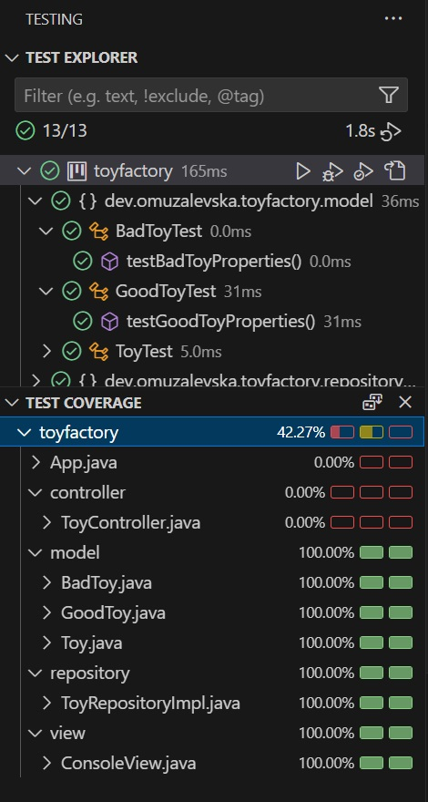

# Toy Factory
<!-- Título
Descripción con sinopsis del proyecto
Pre-requisitos (Que se necesita instalar para poder ejecutar el proyecto)
Pasos para la instalación
Ejecución de los tests (Captura de la cobertura)
Diagramas realizados
Autores -->

## Description
The Toy Factory System is a console-based application designed to manage the creation, deletion, and classification of toys in a toy factory. It allows different roles such as "Elf" and "Santa" to interact with the toy inventory, where the Elf can add, view, and remove toys, while Santa can view categorized lists of toys (Good or Bad) and save the toy list to a CSV file.

The project follows the Model-View-Controller (MVC) architecture, with:

Model: Contains the business logic (Toy and its subclasses).
View: Manages the user interface and displays output.
Controller: Acts as the intermediary between the Model and View.

## Pre-requisites
Before running this project, make sure the following tools and software are installed:

Java Development Kit (JDK) – Version 8 or higher.
Maven – To manage project dependencies.
IDE – Any Java IDE (Visual Studio Code)

## Installation Steps
Clone the repository:
git clone https://github.com/omuzalevska/toyfactory.git
Run the application
The program will prompt you to log in as either an "Elf" or "Santa"

## Running the Tests

## Diagrams

## Authors
Oksana Muzalevska
